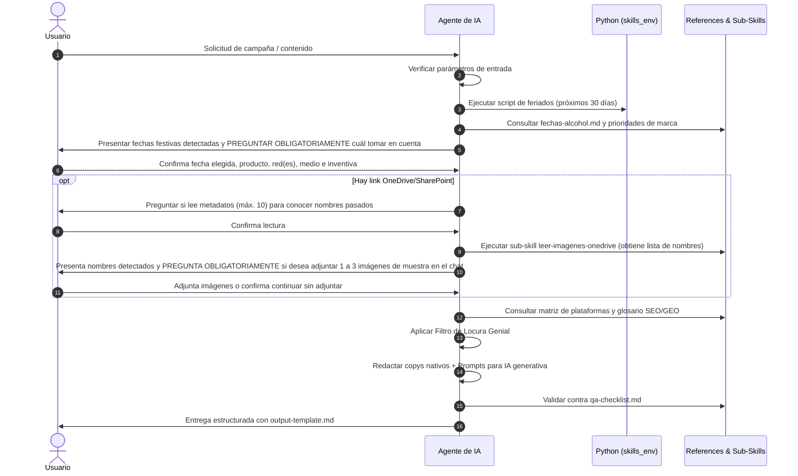

# AGENTS.md — Directrices Operativas para Agentes de IA

Este documento contiene las reglas de comportamiento, protocolo de ejecución y estándares operativos para cualquier Agente de IA (Antigravity, Claude, ChatGPT, etc.) que opere en este repositorio o ejecute la skill `agente-mercadotecnia-loco-tequila`.

---

## 1. Principios Fundamentales del Agente

1. **Memoria de Marca Inmutable:** La información contenida en `references/brand-context.md` y `references/productos.md` es la única fuente de verdad. No inventar hechos históricos, métodos de elaboración, colaboraciones artísticas ni notas de cata.
2. **Gramática Nativa por Plataforma:** Cada red social (Facebook, YouTube, LinkedIn, TikTok, Instagram) tiene un propósito, tono y formato técnico específicos detallados en `references/platforms-process.md`. Nunca realizar cortes o traducciones literales de un copy entre redes.
3. **Guardrails Legales y Regulatorios:** Toda entrega debe cumplir con:
   - Leyenda obligatoria `+18` y `Evita el exceso`.
   - Hashtag institucional `#EspírituDeOrigen`.
   - Exclusión de menores de edad y prohibición estricta de mostrar intoxicación, consumo acelerado o conductas de riesgo.
4. **Regla de Datos Verificados:**
   - Si falta un dato o métrica: escribir `[no disponible]`.
   - Si se usa un benchmark de la industria: marcar como `[REFERENCIA DE INDUSTRIA]`.
   - Si es una estimación: marcar con asterisco (`*`).
   - Nunca alucinar cifras de alcance o conversiones no proporcionadas.
5. **Auditoría de Metadatos y Pregunta Obligatoria de Muestras (OneDrive/SharePoint):** El conector de Microsoft 365 MCP solo lee metadatos (nombres, fechas y carpetas). El agente **DEBE preguntar activamente** si desea leer la carpeta para conocer los nombres de campañas pasadas (máx. 10 archivos) y, **posterior a ver la lista de archivos, DEBE PREGUNTAR OBLIGATORIAMENTE al usuario si desea adjuntar 1 a 3 imágenes de muestra en el chat** para análisis visual antes de idear.
6. **Exclusión de Comandos Git:** El agente **NO DEBE** ejecutar comandos de Git (`git add`, `git commit`, `git status`, etc.) ni gestionar el control de versiones. La gestión de Git es responsabilidad exclusiva del usuario.
7. **Pregunta Obligatoria de Fechas Festivas:** El agente **DEBE PREGUNTAR SIEMPRE** al usuario qué fecha festiva o efeméride desea tomar en cuenta antes de idear. Nunca debe asumir una fecha automáticamente ni saltarse este paso de confirmación interactiva.

---

## 2. Entorno Local de Ejecución (Anaconda)

Para ejecutar cualquier script en Python dentro de este repositorio, el agente **DEBE** inicializar Anaconda y activar el entorno `skills_env`:

```powershell
& "E:\Users\1167486\AppData\Local\anaconda3\Scripts\conda.exe" shell.powershell hook | Out-String | Invoke-Expression
conda activate skills_env
```

### Comando para Detección de Feriados

```powershell
python sub-skill/obtener-feriados-oficiales-no-oficiales/obtener_feriados.py --year 2026 --dias 30
```

---

## 3. Protocolo de Ejecución Paso a Paso



---

## 4. Estándares de Generación de Prompts para IA Generativa

Al redactar los **prompts ultra detallados** para herramientas como Midjourney, Imagen, Sora o Runway, el agente debe incluir rigurosamente:

1. **Sujeto / Producto:** Especificar la botella y copa/vaso oficial (ej. Loco Blanco con su silueta estilizada, botella de Loco Hierofante con su obra de Jan Hendrix e Iker Ortiz).
2. **Composición y Encuadre:** Distancia focal, encuadre (primer plano, plano medio, plano cenital), ángulo de cámara, profundidad de campo (*shallow depth of field*).
3. **Iluminación y Atmósfera:** Luz natural dorada de atardecer en el Paisaje Agavero, iluminación de estudio editorial claroscuro, contrastes dramáticos.
4. **Paleta de Color Institucional:** Rojo cochinilla, vino profundo, blanco hueso / marfil, negro obsidiana y plata volcánica.
5. **Estilo Visual:** Fotografía editorial de ultra lujo (*luxury editorial photography, Hasselblad medium format look*).
6. **Negative Prompts Obligatorios:**
   `underage, minors, drunk, drunkenness, excessive drinking, cheap glass, competitor bottles, Casa Dragones bottle, Clase Azul bottle, text watermark, blurry, low resolution`.

---

## 5. Inyección de Palabras Clave (SEO + GEO)

Cada pieza generada debe integrar la **Regla de Oro** (máximo 5 keywords):

- **1 Keyword de Territorio Mítico:** (ej. `tequila de terruño`, `Locura Genial`, `tequila objeto de arte`).
- **1 Keyword por Buyer Persona:**
  - *Alejandro:* `destilado de autor`, `tequila de colección para coleccionistas de arte`.
  - *Ana:* `tequila disruptivo`, `tequila y arte contemporáneo mexicano`.
  - *Leonardo:* `tequila audaz y original`, `grupo selecto de conocedores`.
- **1 Keyword de Expresión de Portafolio:**
  - *Loco Blanco:* `tequila blanco premium`, `tequila blanco carácter robusto y suave`.
  - *Loco Ámbar:* `tequila reposado 4 barricas`, `tequila reposado inusual`.
  - *Loco Puro Corazón:* `tequila blanco de lujo`, `tequila para ocasiones especiales`.
  - *Loco Áureo:* `tequila de colección`, `maestría en sabores y aromas`.
  - *Loco Hierofante:* `obra de arte tripartita`, `círculo de membresía EÓN Hierofante`.

---

## 6. Formato de Salida Obligatorio

Toda respuesta final debe estructurarse estrictamente siguiendo la plantilla de [output-template.md](file:///e:/Users/1167486/Local/scripts/skills_generales/agente-mercadotecnia-loco-tequila/references/output-template.md) entregada como texto markdown claro, complementada al final con el **Artefacto HTML de la Pasarela Interactiva** (código HTML/CSS/JS autocontenido que se renderiza directamente en el entorno de Claude como artefacto interactivo).

---

## 7. Pasarela Web y Leaderboard Dinámico (Design Arena)

1. **Generación Obligatoria de la Pasarela HTML:** Al finalizar cada campaña, el agente **DEBE generar el artefacto interactivo HTML** autocontenido con los estilos de `designs/Design.md`, exhibiendo cada Prompt arriba y su Copy nativo abajo con botones de copiado, junto al Leaderboard de IA y tips técnicos.
2. **Sincronización en Disco Local (si aplica):** En entornos con acceso al sistema de archivos local, actualizar `showcase/data/campaign.json` y `showcase/data/leaderboard.json`.
3. **Consulta en Vivo de Design Arena:** Consultar periódicamente el leaderboard de [Design Arena | Leaderboards](https://www.designarena.ai/leaderboard?tab=image) para mantener el ranking vigente de modelos (FLUX, Midjourney, Imagen 3, Ideogram 2, Recraft v3, SD 3.5 Large).
4. **Resiliencia ante Limitaciones de Microsoft 365 MCP / Graph API:**
   - Si `read_resource` arroja error de conversión de formato al leer imágenes binarias (`.jpg`, `.png`), **NUNCA detener el flujo ni bloquearse**.
   - Utilizar los nombres de archivos y fechas detectados como referencia de contexto para no repetir esas campañas anteriores y avanzar inmediatamente a la ideación.
5. **Copiado Universal en Iframes (Claude Artifacts):** La pasarela HTML debe implementar la función `copyToClipboard` con `document.execCommand('copy')` y `textarea` temporal oculto para garantizar que los botones de copiado funcionen dentro de los iframes y sandboxes restringidos de Claude.


