# 🗺️ Flujo de Trabajo y Proceso Creativo — Agente de Mercadotecnia Loco Tequila

Este documento describe de forma ejecutiva y visual el proceso de extremo a extremo (*end-to-end*) que ejecuta el **Agente de Mercadotecnia de Loco Tequila** para concebir, redactar y estructurar campañas publicitarias de nivel internacional.

---

## 📊 Diagrama de Flujo Paso a Paso (Mermaid)

```mermaid
flowchart TD
    %% Estilos y Clases
    classDef startEnd fill:#1C1917,stroke:#E8A33D,stroke-width:2px,color:#FFFFFF;
    classDef stepNode fill:#292524,stroke:#6E1E28,stroke-width:1.5px,color:#FAFAF9;
    classDef questionNode fill:#441218,stroke:#E8A33D,stroke-width:2px,color:#FAFAF9;
    classDef subSkillNode fill:#1E293B,stroke:#38BDF8,stroke-width:1.5px,color:#FAFAF9;
    classDef deliveryNode fill:#14532D,stroke:#4ADE80,stroke-width:2px,color:#FAFAF9;

    subgraph FASE1 ["📌 FASE 1: Parámetros y Configuración Inicial"]
        A(["🚀 Inicio / Solicitud del Cliente"]):::startEnd --> B{"❓ PREGUNTA OBLIGATORIA (Clickeable):<br/>¿En qué redes sociales se necesita?<br/><i>(Facebook, Instagram, LinkedIn, YouTube, TikTok, Todas)</i>"}:::questionNode
        B --> C["2. Detección Automática de Fechas<br/><i>(Python: feriados oficiales/no oficiales a 30 días + calendario de bebidas)</i>"]:::subSkillNode
        C --> D{"❓ PREGUNTA OBLIGATORIA:<br/>¿Qué fecha festiva o efeméride<br/>desea tomar en cuenta?"}:::questionNode
        D --> DG{"❓ PREGUNTA OBLIGATORIA:<br/>¿Desea motivo gastronómico?<br/><i>(Tradición culinaria mexicana)</i>"}:::questionNode
        DG --> DS{"❓ PREGUNTA OBLIGATORIA (Clickeable):<br/>¿Te gustaría darme sugerencias<br/>para prompts y copy?"}:::questionNode
        DS --> E["3. Confirmar Producto del Portafolio<br/><i>(Blanco, Ámbar, Puro Corazón, Áureo, Hierofante)</i>"]:::stepNode
        E --> F["4. Seleccionar Medio de Salida<br/><i>(Imagen, Video o Ambos)</i>"]:::stepNode
    end

    subgraph FASE2 ["🔍 FASE 2: Auditoría y No-Repetición Visual"]
        F --> G{"❓ PREGUNTA OBLIGATORIA (Clickeable):<br/>¿Cómo proporcionar referencias previas?<br/><i>(OneDrive/GoogleDrive, Carpeta local/cowork, Chat, Ninguna/Acervo)</i>"}:::questionNode
        G -- Nube (OneDrive/GDrive) --> H["5a. Lectura de Nube vía MCP / Enlace<br/><i>(Auditoría de máx. 10 archivos para conocer temáticas previas)</i>"]:::subSkillNode
        G -- Carpeta local / Cowork --> H2["5b. Lectura de Directorio Local<br/><i>(Extracción de campañas previas en disco)</i>"]:::stepNode
        G -- Imágenes en Chat --> I["5c. Análisis Visual en Chat<br/><i>(Análisis de 1 a 3 fotos de muestra)</i>"]:::stepNode
        G -- Ninguna / Acervo --> J["6. Inspiración con Acervo Propio de la Skill<br/><i>(references/old_campaigns/ y references/loco-tequila/)</i>"]:::stepNode
        H & H2 & I --> J
    end

    subgraph FASE3 ["🧠 FASE 3: Ideación Creativa y Memoria de Marca"]
        J --> K["7. Aplicar Nivel de Inventiva<br/><i>(Original o Locura Genial)</i>"]:::stepNode
        K --> L["8. Filtro Obligatorio de Locura Genial<br/><i>(Creatividad con propósito vs. clichés descartados)</i>"]:::stepNode
        L --> M["9. Conexión con Buyer Persona Objetivo<br/><i>(Alejandro / Ana / Leonardo / Efecto Halo)</i>"]:::stepNode
        M --> N["10. Inyección Estratégica de Keywords<br/><i>(SEO + GEO: Terruño, Persona y Categoría — Máx. 5)</i>"]:::stepNode
    end

    subgraph FASE4 ["✍️ FASE 4: Producción de Copys y Prompts de IA"]
        N --> O["11. Redacción de Copys Nativos por Red<br/><i>(Gramática y tono adaptado a cada plataforma)</i>"]:::stepNode
        O --> EV["11b. Segunda Evaluación: Sentido Común Visual<br/><i>(Vajilla en comida, soporte de copa, preservación de botella)</i>"]:::subSkillNode
        EV --> P["12. Generación de Prompts para IA de Imagen/Video<br/><i>(Gramática brand-context.md + 7 campos obligatorios + CERO procesos de producción)</i>"]:::stepNode
    end

    subgraph FASE5 ["🛡️ FASE 5: Control de Calidad y Guardrails Legales"]
        P --> Q["13. Autoverificación Interna con QA Checklist<br/><i>(+18, Evita el exceso, #EspírituDeOrigen, Hechos inmutables, Cero alambiques/jima)</i>"]:::stepNode
        Q --> R{"¿Cumple todos los estándares<br/>y campos obligatorios?"}:::questionNode
        R -- No --> S["Corrección Silenciosa Inmediata<br/><i>(Reescritura autónoma del prompt o copy)</i>"]:::stepNode
        S --> Q
        R -- Sí --> T["Validación Exitosa"]:::stepNode
    end

    subgraph FASE6 ["✨ FASE 6: Entrega Final Dual"]
        T --> U["14. Entrega en Markdown Estructurado<br/><i>(Copys listos para publicar + Prompts detallados)</i>"]:::deliveryNode
        T --> V["15. Generación de Pasarela Web Interactiva<br/><i>(Showcase HTML autocontenido con copiado en 1 clic y Leaderboard)</i>"]:::deliveryNode
        U & V --> W(["🏁 Campaña Lista para Producción y Publicación"]):::startEnd
    end
```

---

## 📋 Detalle de las Fases del Proceso

### 📌 Fase 1: Configuración de Parámetros
1. **Pregunta Obligatoria de Plataformas Destino:** Se consulta al cliente presentando sin excepción las 5 redes oficiales más la opción «Todas» (`[🔘 Facebook]`, `[🔘 Instagram]`, `[🔘 LinkedIn]`, `[🔘 YouTube]`, `[🔘 TikTok]`, `[🔘 Todas las anteriores]`). El agente nunca debe omitir ninguna de las 5 plataformas ni asumir solo una por defecto.
2. **Detección de Fechas Próximas:** Se ejecuta un script en Python que analiza los próximos 30 días, combinando días festivos oficiales y no oficiales de México con efemérides internacionales del mundo de los destilados y gastronomía.
3. **Confirmación Interactiva:** El agente consulta al usuario para elegir la fecha ancla exacta.
4. **Motivo Gastronómico (Opcional/Cultural):** Si la festividad tiene arraigo tradicional, se ofrece incorporar maridajes de alta gama con Loco Tequila según `references/calendario-gastronomico-mexicano.md`.
5. **Sugerencias Creativas (Pregunta Clickeable para Claude/Codex):** Se presenta la pregunta interactiva con botones clickeables:
   - `[🔘 Sí, dar sugerencias](#)`
   - `[🔘 No, te lo dejo todo a ti agente](#)`
   Permite al cliente guiar el rumbo o delegar la creatividad íntegra al agente.
6. **Selección de Producto y Formato:** Se elige el SKU exacto (Loco Blanco, Ámbar, Puro Corazón, Áureo o Hierofante) y el medio (*Imagen*, *Video* o *Ambos*).

### 🔍 Fase 2: Auditoría y No-Repetición Visual (Nube, Carpeta Local/Cowork, Chat o Acervo)
- **Consulta Obligatoria al Cliente:** Se formulan las 4 opciones de trabajo:
  1. *Link de OneDrive, SharePoint o Google Drive:* Se auditan metadatos o documentos de análisis de las últimas campañas (hasta 10 archivos) para registrar qué conceptos ya fueron explotados.
  2. *Carpeta local / Cowork:* El cliente indica la ruta de su equipo o red compartida para revisar campañas previas en disco.
  3. *Imágenes en chat:* Se invita al cliente a adjuntar de 1 a 3 imágenes de muestra para calibrar el tono estético sin duplicar ejecuciones pasadas.
  4. *Ninguna (Acervo de la skill):* Si el cliente no aporta referencias externas, el agente avanza de inmediato inspirándose en las campañas históricas (`references/old_campaigns/resumen_old_campaigns.md`) y el producto canónico de la propia skill.

### 🧠 Fase 3: Ideación y Memoria de Marca
- **Niveles de Inventiva:**
  - **Original:** Ángulos inesperados y sofisticados dentro de los pilares de marca.
  - **Locura Genial:** Máxima disrupción conceptual y provocación artística permitida por el universo de la marca.
- **Filtro de Locura Genial:** Toda idea debe demostrar pasión, trascendencia y propósito real; se descartan ocurrencias superficiales o imitaciones de la competencia.
- **Enfoque en Audiencias Clave (Buyer Personas):**
  - *Alejandro:* Mentor, coleccionista de arte y legado.
  - *Ana:* Visionaria, amante del diseño contemporáneo y la vanguardia.
  - *Leonardo:* Sibarita, conocedor de procesos auténticos y sofisticación.
- **Optimización SEO / GEO:** Inyección de hasta 5 palabras clave estratégicas para motores de búsqueda tradicionales e inteligencia artificial generativa.

### ✍️ Fase 4: Redacción Nativa y Prompts Generativos
- **Copys Nativos:** Textos redactados desde cero según los formatos técnicos de cada red (Reels, TikToks rápidos, narrativas largas en Facebook, artículos corporativos en LinkedIn).
- **Segunda Evaluación: Sentido Común Visual y Verosimilitud de Escena (`references/evaluacion-sentido-comun-escena.md`):**
  - *Vajilla Obligatoria:* Si hay alimentos (chiles en nogada, mole, etc.), se exige y describe explícitamente vajilla de alta gama (cerámica artesanal, porcelana mate), prohibiendo tajantemente comida servida sobre la mesa o piedra sin plato.
  - *Preservación de lo Primordial:* Inyección de la directiva de preservación morfológica (base de 2 cm, relieve rojo vítreo) para que la IA no olvide la anatomía de la botella ni genere botellas genéricas.
  - *Física y Soporte:* La copa Riedel debe tener apoyo creíble y sombras de contacto reales.
- **Ingeniería de Prompts (Gramática de `references/brand-context.md` + 7 Campos Obligatorios):**
  1. *Sujeto / SKU exacto, botella canon y cristalería oficial (copa Riedel grabada).*
  2. *Composición técnica (ej. 85mm f/1.4, plano medio cerrado).*
  3. *Esquema de iluminación (golden hour, claroscuro editorial cálido).*
  4. *Paleta institucional (carmesí cochinilla, vino profundo, negro obsidiana, etc.).*
  5. *Estilo fotográfico de lujo (Hasselblad medium format).*
  6. *Relación de aspecto (`--ar 4:5`, `--ar 9:16`, `--ar 16:9`).*
  7. *Negative prompt base estricto (anti-embriaguez, sin menores, sin botellas genéricas, anti-comida sin plato, sin botellas de competidores).*
- **REGLA DE ORO DE CONTENIDO:** Prohibición estricta de mostrar procesos de producción del tequila (jima, jimadores, hornos, piedra tahona, alambiques ni operarios) en imágenes o videos, salvo petición expresa del usuario.

### 🛡️ Fase 5: QA y Guardrails Innegociables
- Revisión de leyendas de cumplimiento legal obligatorio: `+18`, `Evita el exceso`, `#EspírituDeOrigen`.
- Fidelidad absoluta a la historia y origen de la marca: *Hacienda La Providencia, El Arenal, Jalisco (Terruño volcánico y agua de manantial).*
- Verificación de ausencia de procesos de destilería y clichés prohibidos (hielo, sal, limón en copa, cerámica pintada).
- **Corrección silenciosa:** Si falta algún parámetro técnico, el agente lo ajusta automáticamente sin fricción para el usuario.

### ✨ Fase 6: Entrega Dual de Alto Impacto
1. **Documento Markdown:** Entrega completa estructurada para revisión y aprobación editorial.
2. **Pasarela Web Interactiva (*Showcase*):** Archivo HTML autocontenido con diseño *dark luxury*, selector de conceptos, vista previa de prompts/copys, botón de copiado en 1 clic y ranking actualizado de herramientas de generación de IA (*FLUX.1, Midjourney, Imagen 3, Recraft*).
