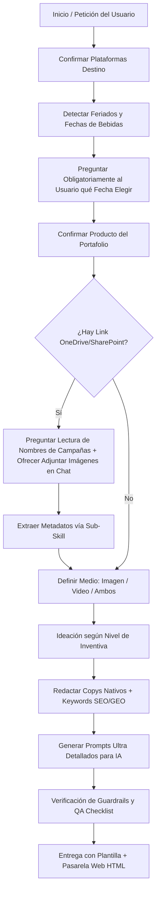

# Agente Creativo y de Mercadotecnia — Loco Tequila

Skill de dirección creativa y mercadotecnia digital end-to-end para **Loco Tequila**, diseñada para generar campañas publicitarias completas compuestas por **copys nativos listos para publicar** y **prompts ultra detallados** para generadores de Inteligencia Artificial de imagen y video (Midjourney, Flux, DALL-E, Sora, Runway, etc.).

---

## 📌 Tabla de Contenidos

1. [Propósito y Alcance](#-propósito-y-alcance)
2. [Estructura del Proyecto](#-estructura-del-proyecto)
3. [Entorno y Requisitos Técnicos](#-entorno-y-requisitos-técnicos)
4. [Parámetros de Entrada](#-parámetros-de-entrada)
5. [Niveles de Inventiva y Filosofía](#-niveles-de-inventiva-y-filosofía)
6. [Flujo de Trabajo del Agente](#-flujo-de-trabajo-del-agente)
7. [Memoria de Marca y Guardrails Innegociables](#-memoria-de-marca-y-guardrails-innegociables)
8. [Sub-Skills Integradas](#-sub-skills-integradas)
9. [Glosario SEO / GEO y Personas](#-glosario-seo--geo-y-personas)

---

## 🎯 Propósito y Alcance

### SÍ Hace:
- Planear y redactar campañas publicitarias end-to-end para Loco Tequila.
- Detectar automáticamente feriados oficiales y no oficiales de México cruzándolos con fechas clave de la industria de bebidas y temporadas prioritarias de marca.
- Adaptar copys con gramática nativa según la red social de destino (Instagram, Facebook, YouTube, LinkedIn, TikTok).
- Generar prompts ultra detallados para modelos generativos de imagen y video acordes con la estética y paleta de la marca.
- Conectarse mediante Microsoft 365 / OneDrive / SharePoint para auditar piezas anteriores e inspirarse sin repetir diseños.
- Integrar estrategia SEO y optimización para motores generativos (GEO).

### NO Hace:
- Publicar o programar contenido directamente en redes.
- Gestionar pautas publicitarias o presupuestos de medios.
- Trabajar con marcas de la competencia (Casa Dragones, Clase Azul, etc.).
- Romper o alterar los hechos históricos y técnicos establecidos de la marca.

---

## 📁 Estructura del Proyecto

```plaintext
agente-mercadotecnia-loco-tequila/
├── SKILL.md                               # Instrucción maestra de la skill
├── README.md                              # Documentación general y técnica
├── AGENTS.md                              # Protocolo y directrices de ejecución para agentes IA
├── .gitignore                             # Reglas de exclusión de Git
│
├── designs/                               # Tokens y guías de diseño institucional
│   └── Design.md                          # Sistema de diseño, paleta de color y tokens oficiales
│
├── imagenes/                              # Recursos gráficos institucionales
│   └── Loco_Tequila_Logo_white.png        # Logo oficial en blanco
│
├── references/                            # Fuente de verdad inmutable de la marca
│   ├── brand-context.md                   # Memoria de marca, buyer personas, manifiesto y guardrails
│   ├── fechas-alcohol.md                  # Calendario de fechas de bebidas y prioridades de marca
│   ├── output-template.md                 # Plantilla estándar de salida de campañas y prompts
│   ├── platforms-process.md               # Matriz por red social y proceso de adaptación
│   ├── productos.md                       # Fichas técnicas del portafolio (Blanco, Ámbar, etc.)
│   ├── qa-checklist.md                    # Lista de verificación de calidad antes de entrega
│   └── seo-geo-glossary.md                # Glosario maestro de keywords y estrategia GEO
│
├── showcase/                              # Pasarela web interactiva (Showcase / Runway)
│   ├── index.html                         # Vista principal de la pasarela y leaderboard
│   ├── styles.css                         # Estilos basados en Design.md y dark luxury
│   ├── app.js                             # Interactividad, carrusel y copiado
│   ├── assets/                            # Recursos locales (logo oficial)
│   └── data/                              # Datasets JSON de campañas y leaderboard
│
└── sub-skill/                             # Sub-habilidades modulares
    ├── leer-imagenes-onedrive/
    │   └── README.md                      # Sub-skill para auditar imágenes previas en OneDrive/SharePoint
    └── obtener-feriados-oficiales-no-oficiales/
        ├── README.md                      # Sub-skill para detección de festivos
        ├── obtener_feriados.py            # Script en Python con scraping y cálculo de feriados
        └── prototipo_feriados.py          # Prototipo exploratorio de scraping y pruebas de feriados
```

---

## ⚙️ Entorno y Requisitos Técnicos

El script de detección de feriados se ejecuta localmente bajo **Anaconda** en el entorno `skills_env`.

### 1. Inicialización de Anaconda en PowerShell

```powershell
& "E:\Users\1167486\AppData\Local\anaconda3\Scripts\conda.exe" shell.powershell hook | Out-String | Invoke-Expression
```

### 2. Activación del Entorno

```powershell
conda activate skills_env
```

### 3. Dependencias del Entorno

Si es necesario instalar o verificar las librerías:

```powershell
pip install holidays requests beautifulsoup4
```

### 4. Ejecución del Script de Feriados

```powershell
python sub-skill/obtener-feriados-oficiales-no-oficiales/obtener_feriados.py --year 2026 --dias 30
```

- `--year AÑO`: Año a consultar (por defecto, el año actual).
- `--dias N`: Filtra únicamente los feriados dentro de los próximos N días (ideal para aviso previo de 30 días).
- `--json ARCHIVO`: Exporta los resultados en formato JSON.

---

## 📥 Parámetros de Entrada

Antes de generar una campaña, la skill solicita o valida los siguientes parámetros:

| Parámetro | Tipo / Opciones | Descripción |
|---|---|---|
| `{{plataformas_destino}}` | Facebook, YouTube, LinkedIn, TikTok, Instagram | Red(es) social(es) destino de la campaña |
| `{{fechas_proximas}}` | Fechas festivas / efemérides | **Obligatorio:** Se detectan a 30 días y se pregunta siempre al usuario cuál desea elegir |
| `{{producto}}` | Loco Blanco, Loco Ámbar, Loco Puro Corazón, Loco Áureo, Loco Hierofante, Portafolio Completo | Expresión de tequila a promocionar |
| `{{medio}}` | Imagen, Video, Ambas | Define el tipo de prompts generativos a producir |
| `{{referencias_visuales}}` | Link de OneDrive / SharePoint *(Opcional)* | Auditoría de metadatos (pregunta al usuario si desea leer la carpeta para extraer nombres de campañas pasadas, máx. 10, y ofrece adjuntar 1 a 3 imágenes de ejemplo en el chat) |
| `{{numero_ideas}}` | Entero (por defecto `3`) | Cantidad de conceptos a idear por plataforma |
| `{{inventiva}}` | `Original` \| `Locura Genial` (por defecto `Original`) | Grado de audacia conceptual |

---

## 💡 Niveles de Inventiva y Filosofía

- **Original ("Nada visto, pero con sentido"):** Cruces inesperados dentro de la memoria de marca (terruño, arte, ocasión, legado). Cambia el encuadre presentando el hecho con un ángulo nuevo.
- **Locura Genial ("Rompe el molde con dirección"):** Creatividad disruptiva, provocación artística y formatos atrevidos sin perder la elegancia y coherencia de marca.

> **Filtro de Locura Genial:** Obligatorio para **toda** idea. La idea debe demostrar creatividad trascendental, innovación disruptiva, valentía para desafiar, pasión profunda y autenticidad radical. Se descartan ideas sin propósito, imitativas o pretenciosas.

---

## 🔄 Flujo de Trabajo del Agente



---

## 🛡️ Memoria de Marca y Guardrails Innegociables

1. **Leyenda Obligatoria:** Toda pieza debe incluir `+18` y `Evita el exceso` (junto con el hashtag `#EspírituDeOrigen`).
2. **Exclusión de Menores:** Segmentación estricta +18 / +21 en pautas según la red.
3. **Cero Tolerancia a Excesos:** Nunca promover intoxicación, conducción bajo los efectos del alcohol ni consumo desmedido.
4. **Hechos de Marca Inviolables:**
   - Origen: El Arenal, Jalisco (Hacienda La Providencia, siglo XVIII).
   - Terruño: Paisaje Agavero UNESCO, agua del Bosque de la Primavera, suelo volcánico.
   - Categoría: Pionero en "Tequila de Terruño" (Single-Estate, 100% Agave Tequilana Weber Azul).
   - Tagline: *"Espíritu de Origen. Espíritu Excepcional. El primer Tequila de Terruño."*
5. **Coherencia Terminológica:** Usar siempre los nombres y términos oficiales establecidos en `references/seo-geo-glossary.md`.

---

## 👥 Glosario SEO / GEO y Personas

- **Alejandro (UHNWI, 45–60 años):** Mentor, coleccionista de arte, alta relojería y gastronomía de autor. Conexión por legado, exclusividad y curaduría.
- **Ana (HNWI, 40–50 años):** Disruptiva, emprendedora y coleccionista de diseño/arte contemporáneo. Conexión por originalidad y piezas limitadas.
- **Leonardo (Mass Affluent, 35–45 años):** Visionario, directivo/empresario, busca autenticidad y sofisticación para compartir quién es.
- **Efecto Halo:** Difusión aspiracional para el público general amante del tequila premium.

---

## 🌐 10. Pasarela Web Interactiva (Showcase / Runway)

La carpeta `showcase/` contiene una aplicación web interactiva diseñada para presentar las campañas publicitarias generadas de forma visual y ejecutiva:

- **Estructura tipo Pasarela:** Muestra cada concepto con su **Prompt generativo** (arriba, con parámetros de render y botón de copiado rápido) y su **Copy nativo** correspondiente (abajo, con hashtags y guardrails legales).
- **Leaderboard de Modelos IA:** Integra un ranking actualizado de herramientas de generación de imágenes basado en [Design Arena | Leaderboards](https://www.designarena.ai/leaderboard?tab=image) (*FLUX.1 [pro], Midjourney v6.1, Google Imagen 3, Ideogram 2.0, Recraft v3, SD 3.5 Large*), evaluando su rendimiento específico para botellas de cristal, paisajes agaveros y tipografía.
- **Guía Técnica de Configuración:** Aspect ratios por plataforma, negative prompts obligatorios y consejos de iluminación claroscuro.
- **Tokens de Diseño:** Implementada con la identidad visual institucional de `designs/Design.md` (banda `--brand-maroon` `#6E1E28`, modo dark luxury y el logo oficial `imagenes/Loco_Tequila_Logo_white.png`).

Para visualizarla, abre directamente `showcase/index.html` en tu navegador web.

